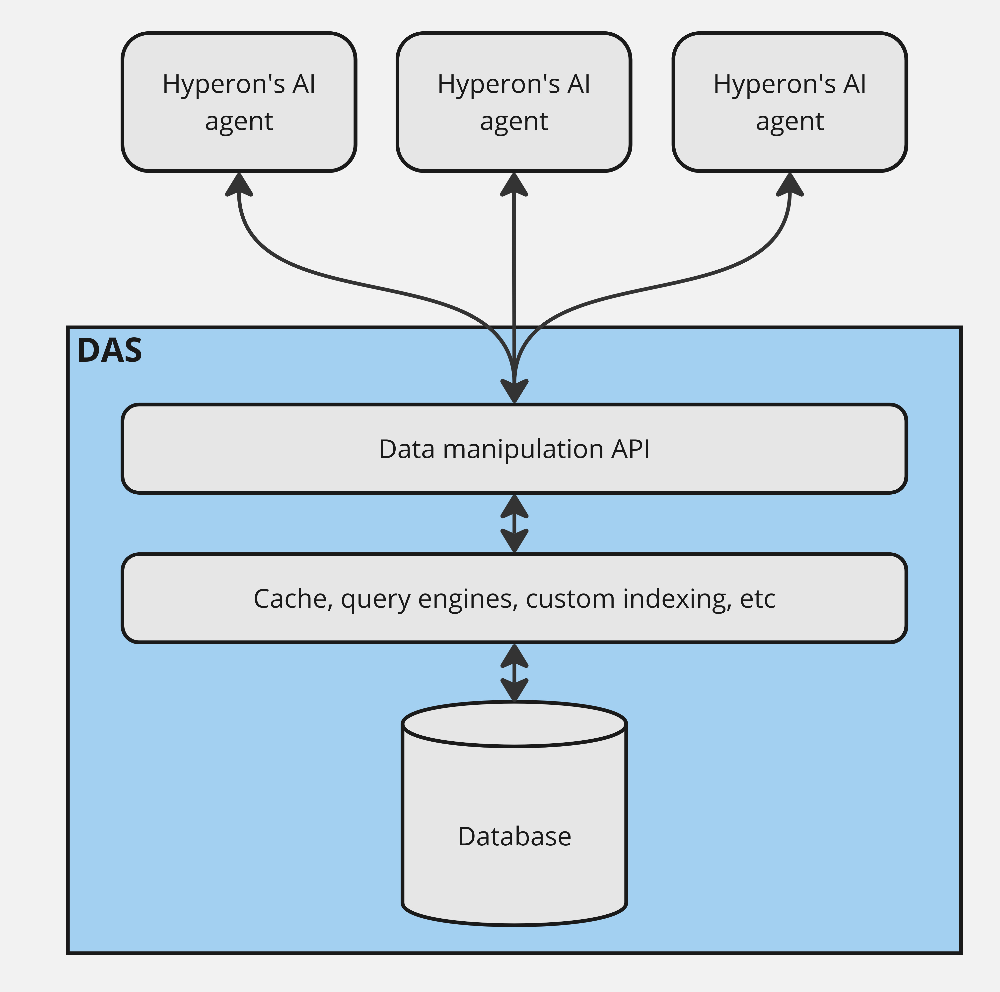
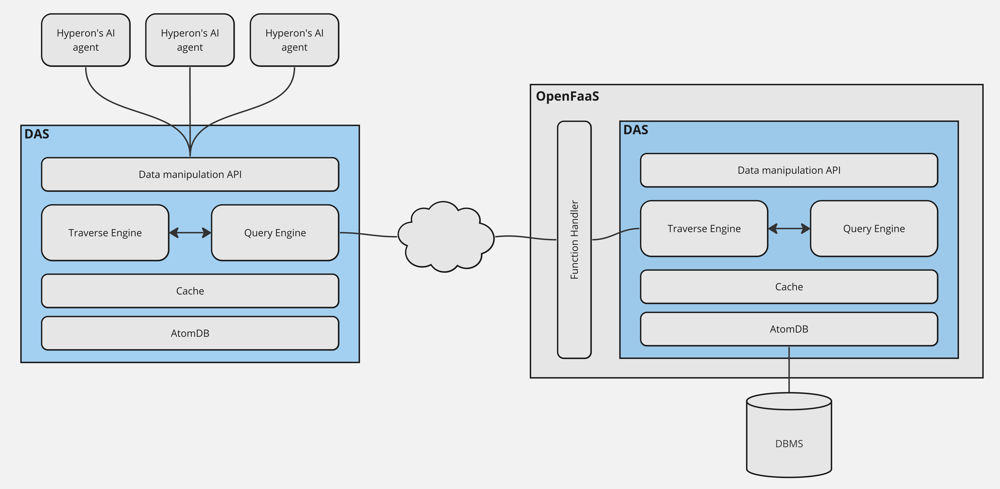

# Distributed Atomspace

Atomspace is the hypergraph OpenCog Hyperon uses to represent and store
knowledge, being the source of knowledge for AI agents and the container of any
computational result that might be created or achieved during their execution.

The __Distributed Atomspace (DAS)__ is an extension of OpenCog Hyperon's
Atomspace into a more independent component designed to support multiple
simultaneous connections with different AI algorithms, providing a flexible
query interface to distributed knowledge bases. It can be used as a component
(e.g. a Python library) or as a stand-alone server to store essentially
arbitrarily large knowledge bases and provide means for the agents to traverse
regions of the hypergraphs and perform global queries involving properties,
connectivity, subgraph topology, etc.

DAS can be understood as a persistence layer for knowledge bases used in
OpenCog Hyperon.

The data manipulation API provides a defined set of operations without exposing
database details such as data modeling and the DBMS (Database Management
System) being used. This is important because it allows us to evolve the data
model inside DAS and even change the DBMS without affecting the integration
with the AI agents.

But being an abstraction for the data model is not the only purpose of DAS.
While performing this connection between AI agents and the knowledge bases, DAS
provides a lot of other functionalities:

* Higher level indexes stored in the DBMS
* Query engine with pattern matching capabilities
* Traverse engine to keep track of hypergraph traversal
* Cache for query results
* Scalable connection manager to connect the DAS with multiple other DASs

This is why DAS is not just a Data Access Object or a database interface layer
but rather a more complex OpenCog Hyperon's component that abstracts not only
data modeling/access itself but also several other algorithms that are closely
related to the way AI agents manipulates information.

## DAS components

DAS is delivered as a Python library
[hyperon-das](https://pypi.org/project/hyperon-das/) which can be used in two
different ways:

1. To create a DAS server which is supposed to contain a knowledge base and
provide it to many remote clients (somehow like a DBMS).
2. To instantiate a DAS in a Python program which can store a smaller local
knowledge base and can, optionally, connect to a remote DAS server, exposing
its contents to the local program. In this case, the local knowledge base can
store its contents in RAM or can use a DB backend to persist it.

Components in the DAs architecture are designed to provide the same[data
manipulation API](https://singnet.github.io/das-query-engine/api/das/)
regardeless of whether it's being used locally or remotelly or, in the case of
a local DAS, whether DB persistence is being used or not.

Part of this API is delagated to __Traverse Engine__, which interacts with the
Query Engine and the Cache to provide means to the user to traverse the
Atomspace hypergraph. Operations like finding the links pointing from/to a
given atom or finding atoms in the surounding neighboorhood are performed by
this engine, which controls the pre-fetching of the surrounding atoms when a
remote DAS is being used, in such a way that following links can be done
quickly.

The __Query Engine__ is where global queries are processed. These are queries
for specific atoms or sets of atoms that satisfies some criteria, including
pattern matching. When making a query, the user can specify whether only local
atoms should be considered or whether atoms in a remote DAS should be searched
as well. If that's the case, the Query Engine connects to a remote OpenFaaS
server to make the queries in the remote DAS and return a answer which is a
proper combination of local and remote information. For instance, if there're
different versions of the same atom in local and remote DAS, the local version
is returned.

Both engines use the __Cache__ in order to make queries involving a remote DAS
faster. The DAS' cache is not exactly like a traditional memory or disc cache,
where data is stored basically in the same way in both, the cache and the
primary data repository, and queries are answered by searching the data in the
former and then in the latter. The DAS's cache implements this functionality
but it also sorts and partitions queries' results in such a way that the caller
sees the most relevant results first.

All the queries that return more than one atom, return an iterator to the
results instead of the results themselves. This way only a subset of the
results is returned in a remote query. When the caller iterates throught this
iterator, other chunks of results are fetched on demand from the remote DAS
until all the results have been visited. Before splitting the results in
chunks, the resulting atoms are sorted by "relevance", which can be a measure
based in atoms' Short and Long Term Importance (STI and LTI), in a way that the
most relevant results are iterated first. This is important because most AI
agents make several queries and visit the results in a combinatorial fashion so
visiting every single possible combination of results is not practical. Having
results sorted by relevance allow the agents to constraint the search and
eventually avoid fetching too many chunks of results from the remote server.

The __AtomDB__ is somehow like a Data Access Object or a database interface
layer to abstract the calls to the database where atoms are actually stored.
Having this abstraction is important because it allows us to change or to
extend the actual data storage without affecting the query algorithms (such as
pattern matching) implemented in traverse and query engines. AtomDB can be
backended by in-RAM data structures or one or more DBMSs.
