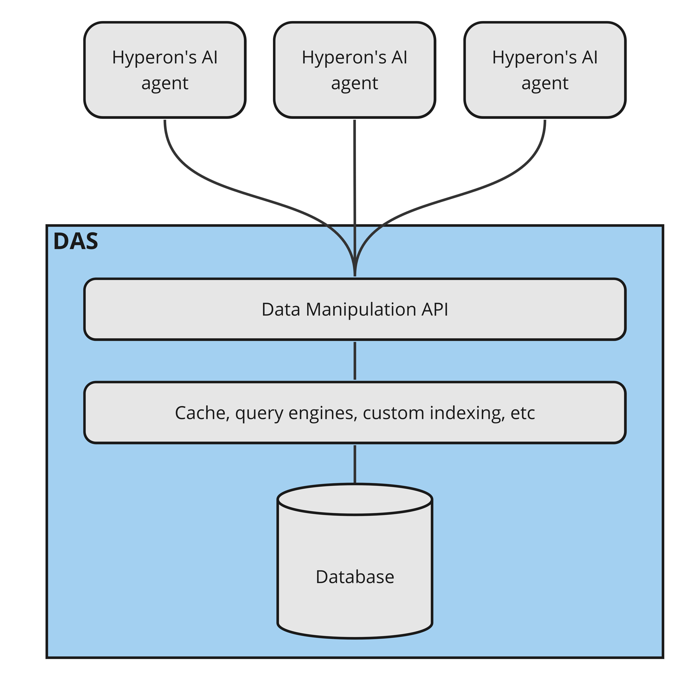
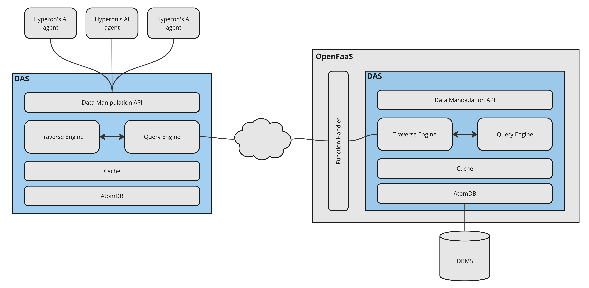
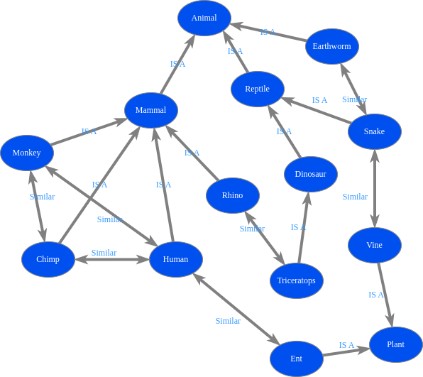
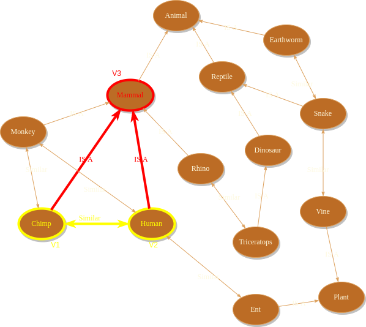
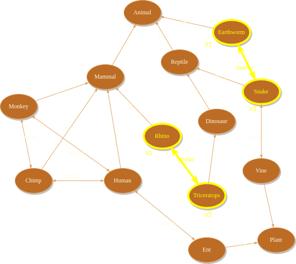
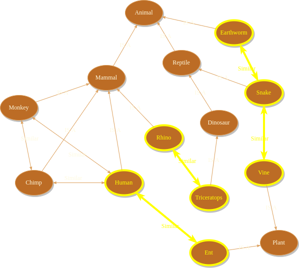
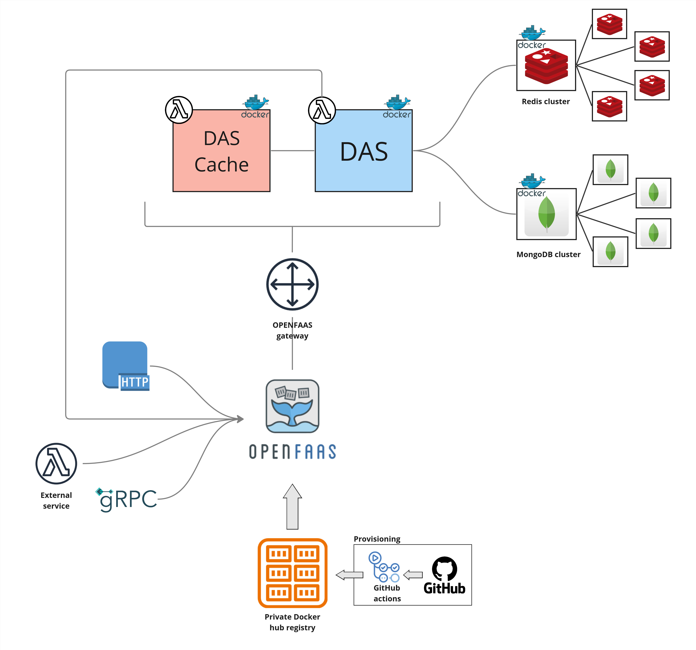

# Distributed Atomspace - Overview

Atomspace is the hypergraph OpenCog Hyperon uses to represent and store
knowledge, being the source of knowledge for AI agents and the container of any
computational result that might be created or achieved during their execution.

The __Distributed Atomspace (DAS)__ is an extension of OpenCog Hyperon's
Atomspace into a more independent component designed to support multiple
simultaneous connections with different AI algorithms, providing a flexible
query interface to distributed knowledge bases. It can be used as a component
(e.g. a Python library) or as a stand-alone server to store essentially
arbitrarily large knowledge bases and provide means for the agents to traverse
regions of the hypergraphs and perform global queries involving properties,
connectivity, subgraph topology, etc.

DAS can be understood as a persistence layer for knowledge bases used in
OpenCog Hyperon.

<p align="center">

</p>


The data manipulation API provides a defined set of operations without exposing
database details such as data modeling and the DBMS (Database Management
System) being used. This is important because it allows us to evolve the data
model inside DAS and even change the DBMS without affecting the integration
with the AI agents.

But being an abstraction for the data model is not the only purpose of DAS.
While performing this connection between AI agents and the knowledge bases, DAS
provides a lot of other functionalities:

* Higher level indexes stored in the DBMS
* Query engine with pattern matching capabilities
* Traverse engine to keep track of hypergraph traversal
* Cache for query results
* Scalable connection manager to connect the DAS with multiple other DASs

This is why DAS is not just a Data Access Object or a database interface layer
but rather a more complex OpenCog Hyperon's component that abstracts not only
data modeling/access itself but also several other algorithms that are closely
related to the way AI agents manipulate information.

## Table of contents

- [DAS Components](#das-components)
- [Higher Level Indexing](#higher-level-indexing)
- [Pattern Matcher](#pattern-matcher)
- [Mapping knowledge bases to nodes and links](#mapping-knowledge-bases-to-nodes-and-links)
- [DAS Server Deployment and Architecture](#das-server-deployment-and-architecture)

## DAS Components

DAS is delivered as a Python library
[hyperon-das](https://pypi.org/project/hyperon-das/) which can be used in two
different ways:

1. To create a DAS server which is supposed to contain a knowledge base and
provide it to many remote clients (somehow like a DBMS).
2. To instantiate a DAS in a Python program which can store a smaller local
knowledge base and can, optionally, connect to one or more remote DAS servers,
exposing their contents to the local program. In this case, the local knowledge
base can store its contents in RAM or can use a DB backend to persist it.

<p align="center">

</p>

Components in the DAS architecture are designed to provide the same 
[data manipulation API](https://singnet.github.io/das-query-engine/api/das/)
regardless of whether it's being used locally or remotely or, in the case of
a local DAS, whether DB persistence is being used or not.

Part of this API is delegated to __Traverse Engine__, which interacts with the
Query Engine and the Cache to provide means to the user to traverse the
Atomspace hypergraph. Operations like finding the links pointing from/to a
given atom or finding atoms in the surrounding neighborhood are performed by
this engine, which controls the pre-fetching of the surrounding atoms when a
remote DAS is being used, in such a way that following links can be done
quickly.

The __Query Engine__ is where global queries are processed. These are queries
for specific atoms or sets of atoms that satisfies some criteria, including
pattern matching. When making a query, the user can specify whether only local
atoms should be considered or whether atoms in remote DASs should be searched
as well. If that's the case, the Query Engine connects to the remote OpenFaaS
servers to make the queries in the remote DASs and return a answer which is a
proper combination of local and remote information. For instance, if there're
different versions of the same atom in local and one of the remote DASs, the
local version is returned.

Both engines use the __Cache__ in order to make queries involving a remote DAS
faster. The DAS' cache is not exactly like a traditional cache, where data is
stored basically in the same way in both, the cache and the primary data
repository, and queries are answered by searching the data in the former and
then in the latter. The DAS's cache implements this functionality but it also
sorts and partitions queries' results in such a way that the caller sees the
most relevant results first.

All the queries that return more than one atom, return an iterator to the
results instead of the results themselves. This way only a subset of the
results are returned in a remote query. When the caller iterates through this
iterator, other chunks of results are fetched on demand from the remote DAS
until all the results have been visited. Before splitting the results in
chunks, the resulting atoms are sorted by "relevance", which can be a measure
based in atoms' Short and Long Term Importance (STI and LTI), in a way that the
most relevant results are iterated first. This is important because most AI
agents make several queries and visit the results in a combinatorial fashion so
visiting every single possible combination of results are not practical. Having
results sorted by relevance allow the agents to constraint the search and
eventually avoid fetching too many chunks of results from the remote server.

The __AtomDB__ is somehow like a Data Access Object or a database interface
layer to abstract the calls to the database where atoms are actually stored.
Having this abstraction is important because it allows us to change or to
extend the actual data storage without affecting the query algorithms (such as
pattern matching) implemented in traverse and query engines. AtomDB can be
backended by in-RAM data structures or one or more DBMSs.

## Higher Level Indexing

DAS uses a DBMS to store atoms. By doing so it uses the indexing capabilities
of this DBMS to retrieve atoms faster. But in addition to this, DAS also
creates other custom indexes and stores these indexes in another DBMS. The most
relevant of such indexes is the Pattern Inverted Index.

An inverted index is a data structure which stores a map from contents (words,
sentences, numbers, etc) to where they can be found in a given data container
(database, file system etc).

This type of data structure is largely used in document retrieval systems to
implement efficient search engines. The idea is spending computational time
when documents are inserted in the document base to index and record the words
that appear in each document (and possibly the position they happen inside the
documents). Afterwards this index can be used by the search engine to
efficiently locate documents that contain a given set of keywords.

The entities in the Opencog Hyperon's context are different from the ones in
typical document retrieval systems but their roles and the general idea of the
algorithms are very similar. In OpenCog Hyperon's context, a knowledge base is
a set of toplevel links (which may point to nodes or to other links). When
the knowledge base is loaded, we can create an inverted index of patterns
present in each toplevel link and use such index later to perform pattern
matching.

For instance, given as toplevel link like this one:

```
Inherits
  <Concept A>
  <Concept B>
```

We could add entries like these ones in the Pattern Inverted Index (where `H1`
is the handle of the toplevel link above):

```
Inherits * <Concept B> ==> H1
Inherits <Concept A> * ==> H1
Inherits * * ==> H1
```

## Pattern Matcher

DAS' query engine can answer pattern matching queries. These are queries where
the caller specifies a _pattern_ i.e. a boolean expression of subgraphs with
nodes, links and wildcards and the engine finds every subgraph in the knowledge
base that satisfies the passed expression.

For instance, suppose we have the following knowledge base in DAS.

<p align="center">

</p>

We could search for a pattern like:

```
AND
  Similar(V1, V2)
  NOT
    AND
      IS_A(V1, V3)
      IS_A(V2, V3)
```

`V1`, `V2` and `V3` are wildcards or variables. In any candidate subgraph
answer, the atom replacing `V1`, for instance, should be the same in all the
links where `V1` appears. In other words, with this pattern we are searching
for two nodes `V1` and `V2` such that there exist a similarity link between
them but there's no pair of inheritance links pointing `V1` and `V2` to the
same node `V3`, no matter the value of `V3`.

In this example, `Chimp` and `Human` are not a suitable answer to replace `V1`
and `V2` because there's a possible value for `V3` that satisfies the `AND`
clause in the pattern, as shown below.

<p align="center">

</p>

On the other hand, there are other pair of nodes which could be used to match
`V1` and `V2` whitout matching the `AND` clause, as shown below.

<p align="center">

</p>

The answer for the query is all the subgraphs that satisfy the pattern. In our
example, the answer would be as follows.

<p align="center">

</p>

## Mapping knowledge bases to nodes and links

Before loading a knowledge base into DAS, you need to define a proper mapping
to Atomspace nodes and links. DAS doesn't make any assumptions regarding nodes
or link types, arity etc. When adding nodes and links using DAS' API, one may
specify atom types freely and the semantic meaning of such atom types are
totally concerned with the application. DAS don't make any kind of processing
based in pre-defined types (actually, there are no internally pre-defined atom
types).

DAS also doesn't provide a way to read a text or SQL or whatever type of file in
order to load a knowledge base. There's no DAS-defined file syntax for this.
If one needs to import a knowledge base, it needs to provide a proper loader
application to parse the input file(s) and make the proper calls to DAS' API in
order to add nodes and links.

Surely one of the interesting topics for future/on-going work on DAS is to
provide loaders (and respective nodes/links mapping) for different types of
knowledge base formats like SQL, Atomese, etc. We already have such a
[loader for MeTTa files](https://github.com/singnet/das-metta-parser).

## DAS Server Deployment and Architecture

DAS server is deployed in a [Lambda Architecture](https://en.wikipedia.org/wiki/Lambda_architecture)
based either in [OpenFaaS](https://www.openfaas.com/) or [AWS Lambda](https://aws.amazon.com/pm/lambda/).
We made a comparative study of these two architectures (results are presented in
this [report](https://docs.google.com/document/d/1kQhM62T3TIb3ECoqBxmqPulMciJq7Vev3-f_Gnhes_s/))
and decided to prioritize OpenFaaS.
Although deployment in AWS Lambda is still possible, currently only OpenFaaS is
supported by [our automated deployment tool](https://github.com/singnet/das-toolbox).
This architecture is presented in the diagram below.


<p align="center">

</p>

When deploying in AWS Lambda, [Redis](https://redis.io/) and
[MongoDB](https://www.mongodb.com/) can be replaced by AWS'
[DocumentDB](https://aws.amazon.com/pt/documentdb/) and
[ElastiCache](https://aws.amazon.com/elasticache/redis/) but the overall
structure is basically the same.

Functions are deployed in servers in the cloud as
[Docker](https://www.docker.com/) containers, built in [our CI/CD pipeline](Deployment-Process.md)
by automated [GitHub Actions](https://docs.github.com/en/actions) scripts and
stored in a private Docker hub registry.

Clients can connect using HTTP, gRPC or an external lambda functions (OpenFaaS
functions can only connect to OpenFaaS and the same is true for AWS functions).

DAS is versioned and released as a [library in PyPI](https://pypi.org/project/hyperon-das/).
