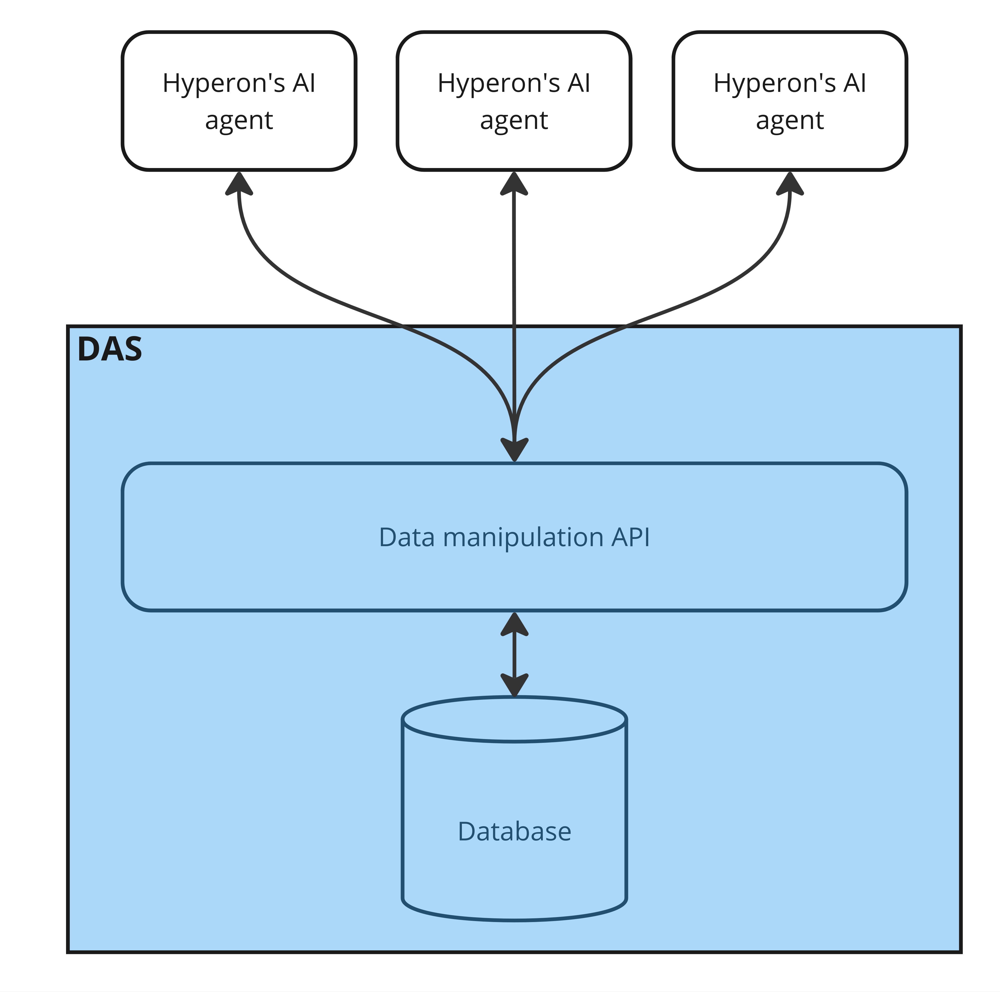

body {
  margin: 0;
}

#over img {
  margin-left: auto;
  margin-right: auto;
  display: block;
}

# Distributed Atomspace

Atomspace is the hypergraph OpenCog Hyperon uses to represent and store
knowledge, being the source of knowledge for AI agents and the container of any
computational result that might be created or achieved during their execution.

The __Distributed Atomspace (DAS)__ is an extension of OpenCog Hyperon's
Atomspace into a more independent component designed to support multiple
simultaneous connections with different AI algorithms, providing a flexible
query interface to distributed knowledge bases. It can be used as a component
(e.g. a Python library) or as a stand-alone server to store essentially
arbitrarily large knowledge bases and provide means for the agents to traverse
regions of the hypergraphs and perform global queries involving properties,
connectivity, subgraph topology, etc.

DAS can be understood as a persistence layer for knowledge bases used in
OpenCog Hyperon.

*DAS is OpenCog Hyperon's persistence layer.*

