## New Version of DAS AtomDB

1.  Go to the repository at AtomDB repository.

To publish a new version of DAS AtomDB, the first step is to access the
[<u>AtomDB repository</u>](https://github.com/singnet/das-atom-db).

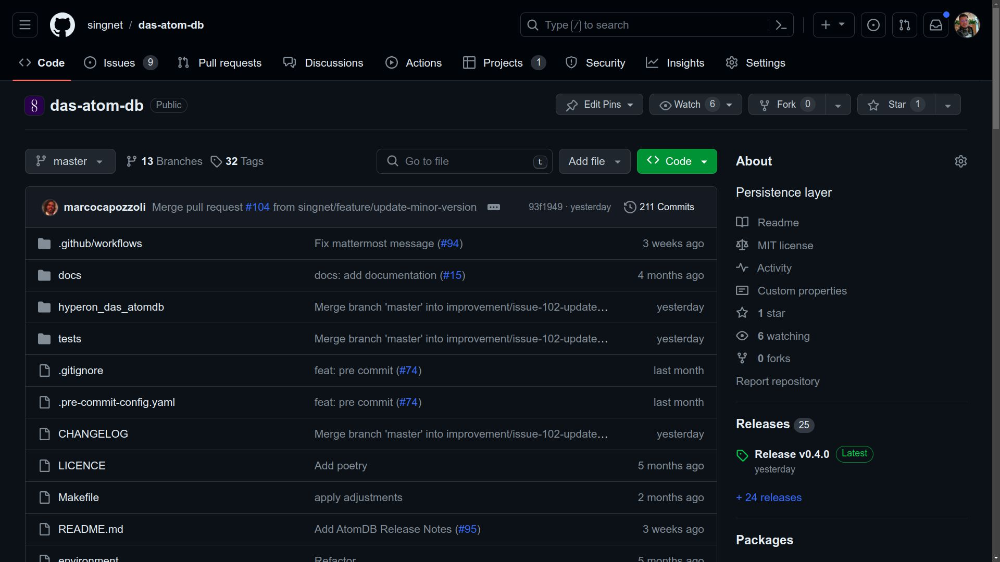

2.  Update the version parameter in **_pyproject.toml_**

Before starting to publish the version, it is crucial to ensure that the
**pyproject.toml** file is updated with the number of the desired new
version, locating and changing the version parameter in the
**\[tool.poetry\]** section.

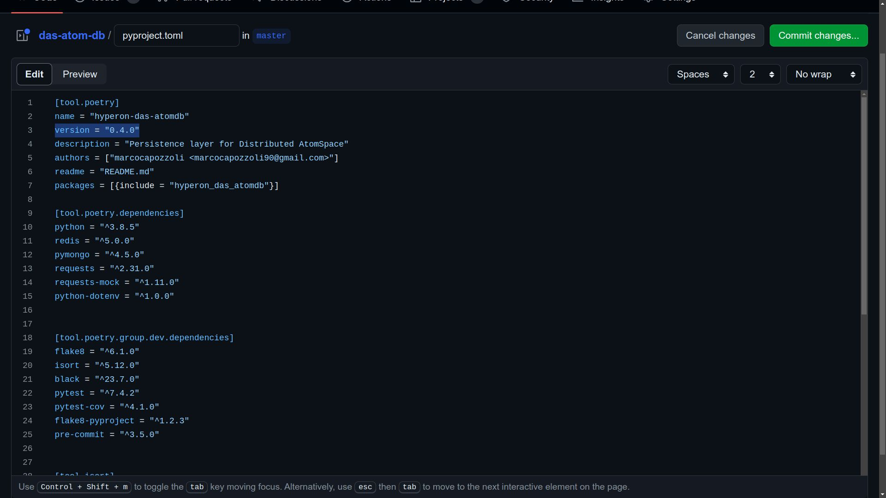

3.  Commit the changes

After this change, it is necessary to commit to the master branch to
record the change.

4.  Verify latest created tag before versioning

It is important to note what the last version created was at [<u>https://github.com/singnet/das-atom-db/tags</u>](https://github.com/singnet/das-atom-db/tags) before creating a new version.

5.  Execute PyPI Publishing Workflow
    Navigate to Actions, select the "Publish to PyPI" workflow, and click on "Run workflow." Choose the master branch, enter the version number in the form that appears (format: 1.0.0) ensure that the inserted version matches the one previously added in the **pyproject.toml** file, and click the "Run workflow" button.

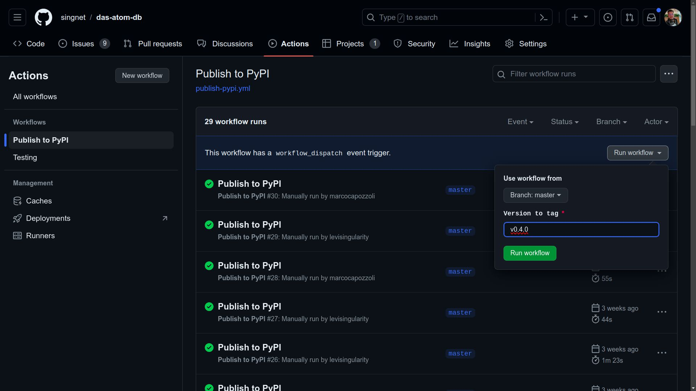

6.  Monitor the workflow execution. Ensure all jobs complete successfully.

After the workflow execution, refresh the page and check if a new
workflow is running. By clicking on it, you can track all jobs. At the
end of the process, all jobs should have a green check mark. If there is
an error in any job, it is possible to click on it to view the logs and
identify the cause of the problem.

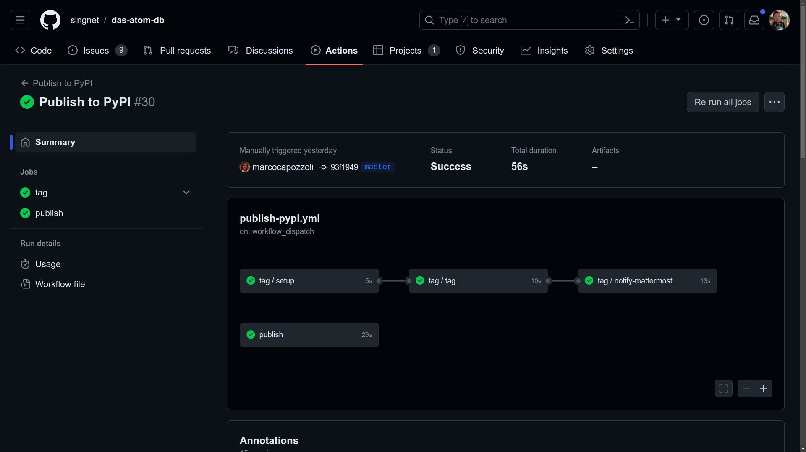

7.  Verify the new tag at DAS AtomDB repository tags and pypi project history.

If everything goes as expected, the new version tag should be available
at
[<u>https://github.com/singnet/das-atom-db/tags</u>](https://github.com/singnet/das-atom-db/tags)
and
[<u>https://pypi.org/project/hyperon-das-atomdb/#history</u>](https://pypi.org/project/hyperon-das-atomdb/#history).

## New Version of DAS Query Engine

1.  Go to the repository at the [<u>Query Engine repository</u>](https://github.com/singnet/das-query-engine).

To publish a new version of DAS Query Engine, follow a process similarto the one described above for Das AtomDB. Access the repository at[<u>https://github.com/singnet/das-query-engine</u>](https://github.com/singnet/das-query-engine)

2.  Update the version parameter in **_pyproject.toml_**

Make sure to update the version number in the **pyproject.toml** file. Additionally, it is necessary to update the version of **hyperon-das-atomdb** in the dependencies, as specified in the **\[tool.poetry.dependencies\]** section.

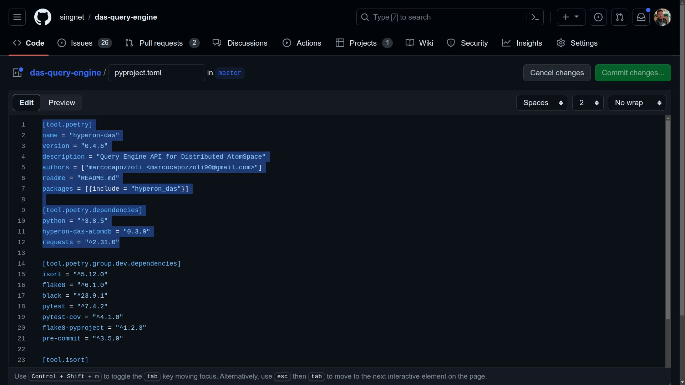

3.  Commit this change to the master branch.

After this change, it is necessary to commit to the master branch to record the change.

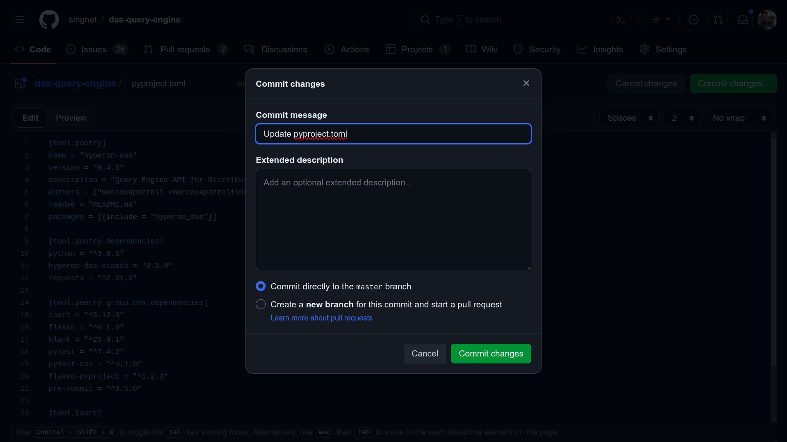

4.  Verify latest created tag before versioning

It is important to note what the last version created was at [<u>https://github.com/singnet/das-query-engine/tags</u>](https://github.com/singnet/das-query-engine/tags) before creating a new version.

5.  Execute PyPI Publishing Workflow

Initiate the 'Publish to PyPI' Workflow Manually via the 'Actions' Tab in the Repository. Click 'Run workflow' and proceed with the provided instructions, ensuring the master branch is selected. Enter the desired version number in the format 1.0.0, then click 'Run workflow' to proceed.

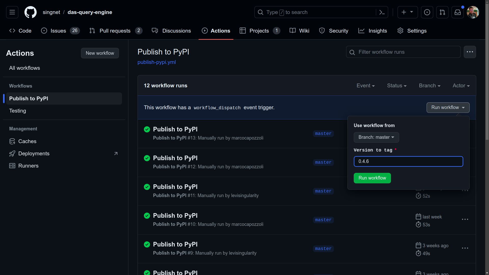

6.  Monitor the workflow execution. Ensure all jobs complete successfully.

Just like in the case of DAS AtomDB, refresh the page and check if a new workflow is running. By clicking on it, you can track all jobs. At the end of the process, all jobs should have a green check mark. If there is an error in any job, it is possible to click on it to view the logs and identify the cause of the problem.

7.  Verify the new tag at DAS Query Engine repository tags and pypi project history.

If everything goes as expected, the new version tag should be available at [<u>https://github.com/singnet/das-query-engine/tags</u>](https://github.com/singnet/das-query-engine/tags)
and [<u>https://pypi.org/project/hyperon-das/#history</u>](https://pypi.org/project/hyperon-das/#history).

## New Version of DAS Serverless Functions

1.  Navigate to the [<u>DAS Serverless Functions repository</u>](https://github.com/singnet/das-serverless-functions/).

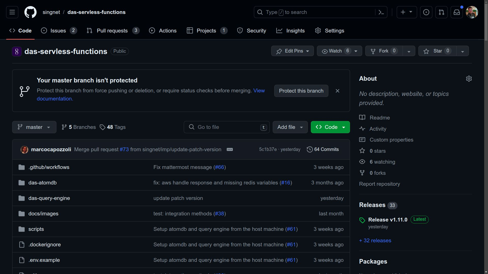

2.  Update the **hyperon-das** version in the requirements file

Update the version of the **hyperon-das** in the **das-query-engine/requirements.txt** file. This ensures that the correct version is used during the workflow build.

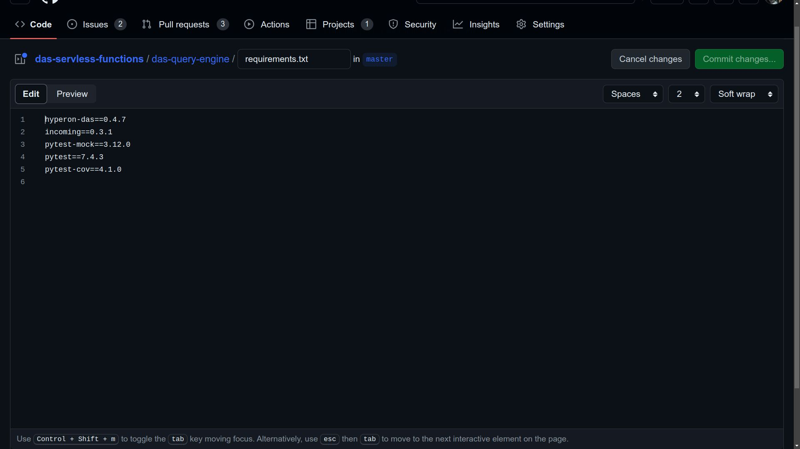

3.  Commit the change to the master branch.

After this change, it is necessary to commit to the master branch to record the change.

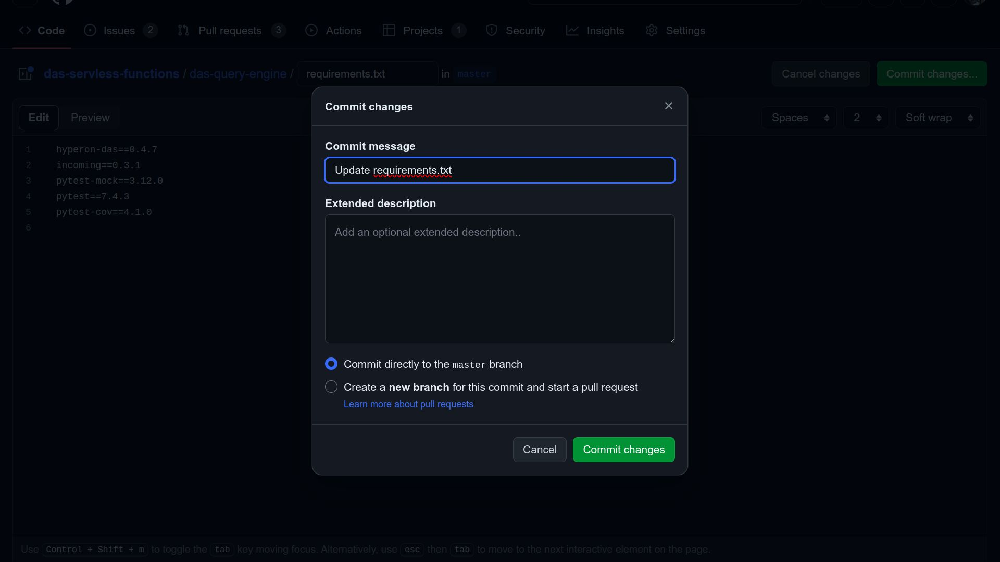

4.  Verify latest created tag before versioning

It is important to note what the last version created was at [<u>https://github.com/singnet/das-serverless-functions/tags</u>](https://github.com/singnet/das-serverless-functions/tags) before creating a new version.

5.  Select the "Vultr Build" workflow in Actions and run it manually.

Manually trigger the 'Vultr Build' workflow via the 'Actions' tab in the repository. Ensure the master branch is selected, then input the desired version number following the format 1.0.0. Next, choose 'das-query-engine' from the dropdown menu, and finally, click 'Run workflow' to proceed.

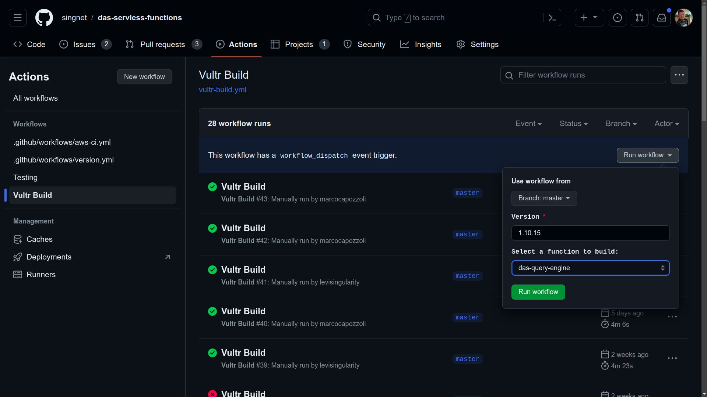

6.  Monitor the workflow execution. Ensure all jobs complete successfully.

After the workflow execution, refresh the page and check if a new workflow is running. By clicking on it, you can track all jobs. At the end of the process, all jobs should have a green check mark. If there is an error in any job, it is possible to click on it to view the logs and identify the cause of the problem.

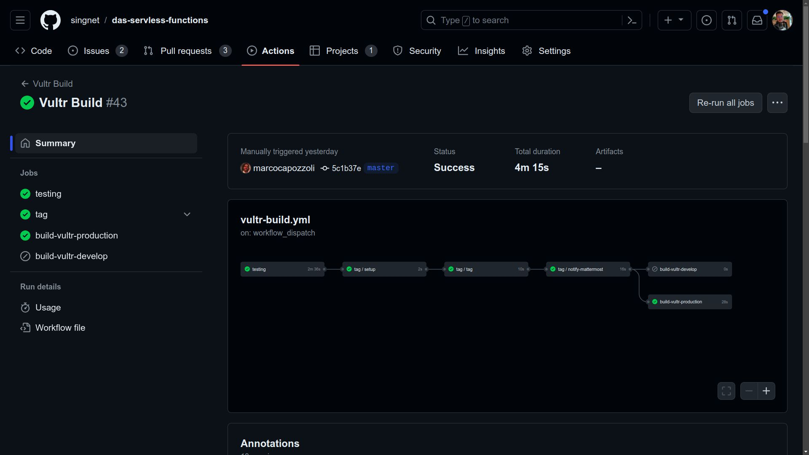

7.  Verify the new tag at DAS Serverless Functions repository tags and Docker Hub.

It is important to note that this pipeline should generate an img on Docker Hub, following the format **1.0.0-queryengine**. Make sure that the img is generated correctly and available at [<u>https://hub.docker.com/r/trueagi/das/tags</u>](https://hub.docker.com/r/trueagi/das/tags). After the workflow execution, verify if all jobs were successfully completed. The new version tag should be available at [<u>https://github.com/singnet/das-serverless-functions/tags</u>](https://github.com/singnet/das-serverless-functions/tags).

## Deploying the Built Image to Production and Development Environments

1.  For deployment, navigate to DAS Infra Stack Vultr repository.

The publication process of the img generated in the production and development environments is carried out in the [<u>das-infra-stack-vultr repository</u>](https://github.com/singnet/das-infra-stack-vultr/).

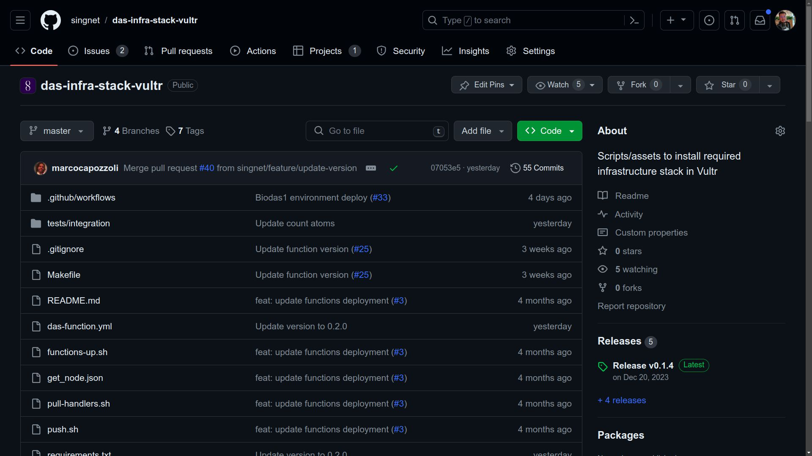

2.  Update **requirements.txt** and **das-function.yml**.

Before starting the deployment, it is necessary to update the version of **hyperon-das** in the **requirements.txt** file, ensuring that the correct version is used during integration tests. Before committing the changes to a branch, make the necessary changes in the **das-function.yml** file, updating the image version to the one generated earlier.

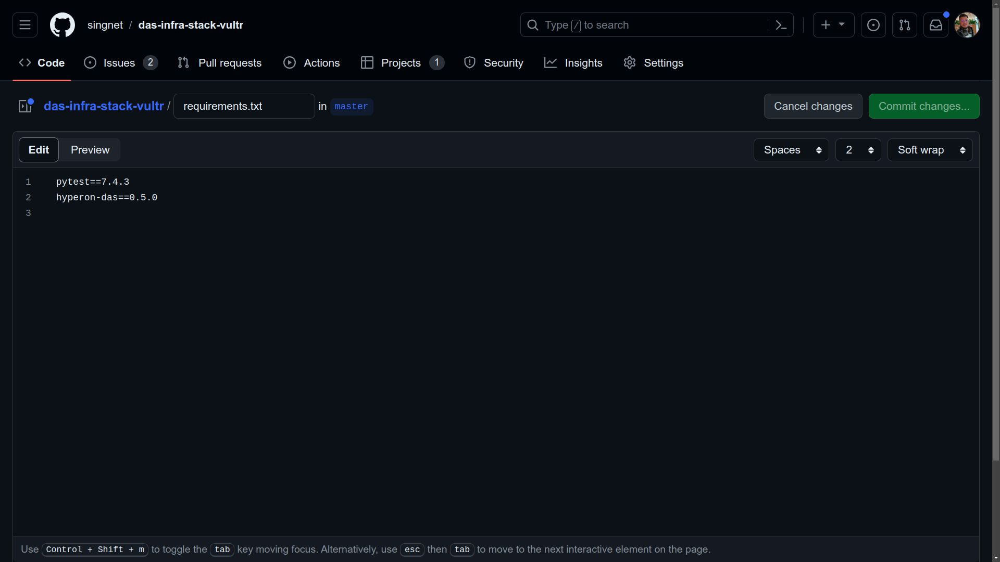

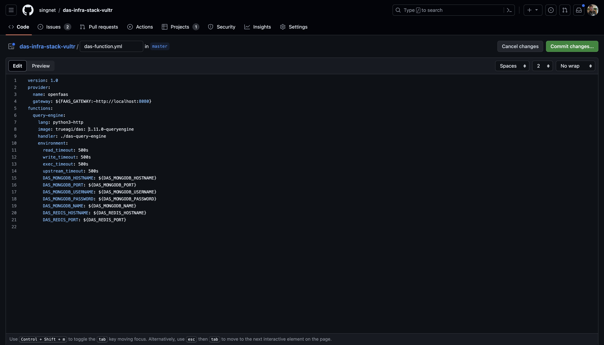

3.  Commit/Merge the changes to the develop branch.

Commit your changes to the 'develop' branch or merge them into the 'develop' branch for deployment to the development environment. Following the merge, the 'Vultr Deployment' pipeline will initiate automatically. Verify the successful completion of all jobs with the 'develop' suffix to ensure the development environment is accurately updated.

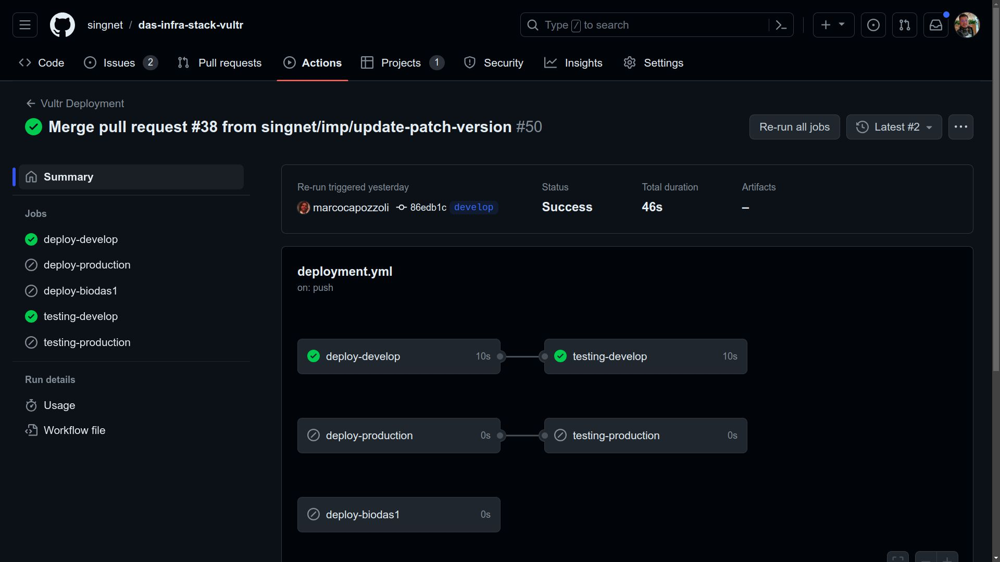

4.  Merge develop branch into master.

After verification, make a PR from develop to master. After the merge
to master, check if all jobs were successfully completed, ensuring
that the production environment is correctly updated. If errors occur
during tests, they are likely related to the response format, which
may have been changed due to previously published libraries. In case
of problems, it is possible to rollback the version by reverting the
commit to return to the previous version.

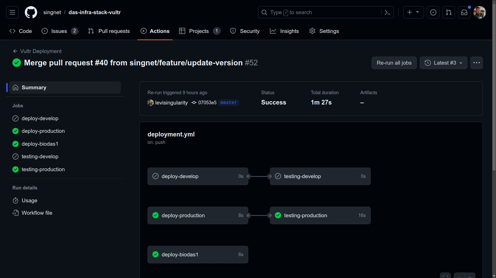

## New Version of DAS Metta Parser

1.  Go to the repository at the [<u>DAS Metta Parser repository</u>](https://github.com/singnet/das-metta-parser).

To publish a new version of DAS Metta Parser, access the repository at[<u>https://github.com/singnet/das-metta-parser</u>](https://github.com/singnet/das-metta-parser)

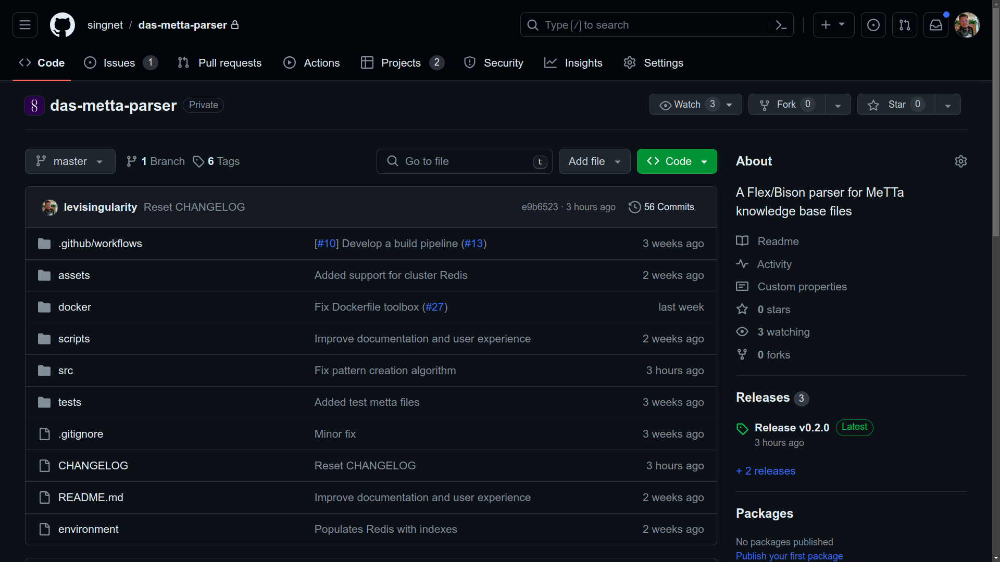

2.  Verify latest created tag before versioning

It is important to note what the last version created was at [<u>https://github.com/singnet/das-metta-parser/tags</u>](https://github.com/singnet/das-metta-parser/tags) before creating a new version.

3.  Execute DAS Metta Parser Build Workflow

Initiate the 'DAS Metta Parser Build' Workflow Manually via the 'Actions' Tab in the Repository. Click 'Run workflow' and proceed with the provided instructions, ensuring the master branch is selected. Enter the desired version number in the format 1.0.0, then click 'Run workflow' to proceed.

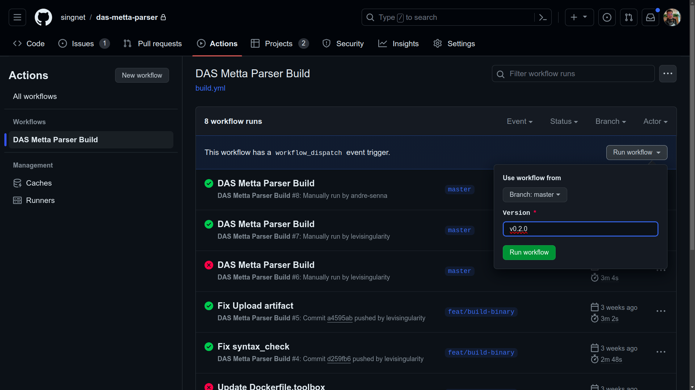

4.  Monitor the workflow execution. Ensure all jobs complete successfully.

Refresh the page and check if a new workflow is running. By clicking on it, you can track all jobs. At the end of the process, all jobs should have a green check mark. If there is an error in any job, it is possible to click on it to view the logs and identify the cause of the problem.

5.  Verify the new tag at DAS Metta Parser repository tags and Docker Hub.

It is important to note that this pipeline should generate an image on Docker Hub, following the format **1.0.0-toolbox**. Make sure that the image is generated correctly and available at [<u>https://hub.docker.com/r/trueagi/das/tags</u>](https://hub.docker.com/r/trueagi/das/tags). After the workflow execution, verify if all jobs were successfully completed. The new version tag should be available at [<u>https://github.com/singnet/das-metta-parser/tags</u>](https://github.com/singnet/das-metta-parser/tags).

## New version of DAS Toolbox

1.  Go to the DAS Toolbox repository.

To publish a new version of DAS Toolbox, access the repository at [<u>https://github.com/singnet/das-toolbox/</u>](https://github.com/singnet/das-toolbox/).

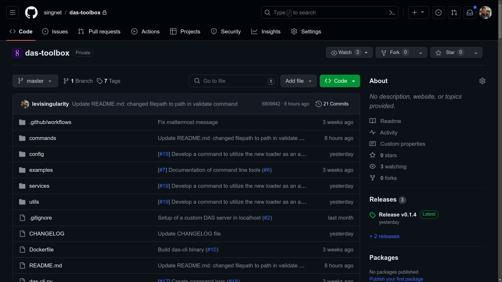

2. Update the toolbox image version in **_src/config/config.py_**

Ensure to update the toolbox image version number in the **src/config/config.py** file. This is important because syntax check and loader are executed from this toolbox image.

3.  Commit this change to the master branch.

After this change, it is necessary to commit to the master branch to record the change.

2.  Verify latest created tag before versioning

It is important to note what the last version created was at [<u>https://github.com/singnet/das-toolbox/tags</u>](https://github.com/singnet/das-toolbox/tags) before creating a new version.

3.  Run the "DAS CLI Build" workflow from Actions.

Manually execute the “DAS CLI Build” workflow through the “Actions” tab in the repository. Click 'Run workflow' and proceed with the provided instructions, ensuring the master branch is selected. Enter the desired version number in the format 1.0.0, then click 'Run workflow' to proceed.

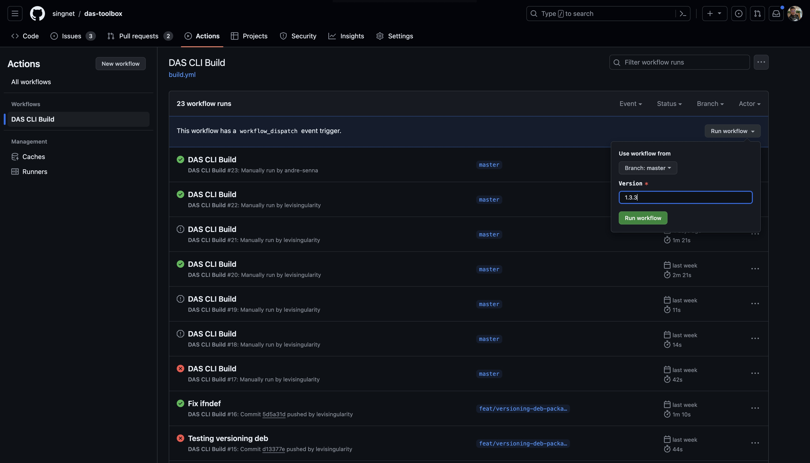

4.  Monitor the workflow execution. Ensure all jobs complete successfully.

After the workflow execution, refresh the page and check if a new workflow is running. By clicking on it, you can track all jobs. At the end of the process, all jobs should have a green check mark. If there is an error in any job, it is possible to click on it to view the logs and identify the cause of the problem.

5.  Verify the new tag at DAS Toolbox repository tags

After the workflow execution, verify if all jobs were successfully completed. The new version tag should be available at [<u>https://github.com/singnet/das-toolbox/tags</u>](https://github.com/singnet/das-toolbox/tags). Additionally, the CLI file generated by the pipeline will be available for download in the workflow artifacts, allowing its use locally.

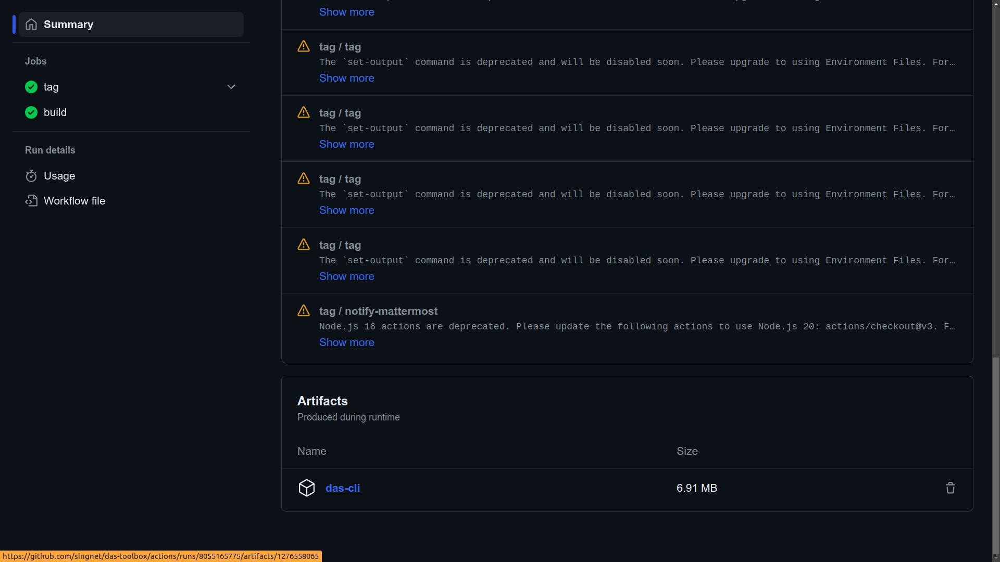
